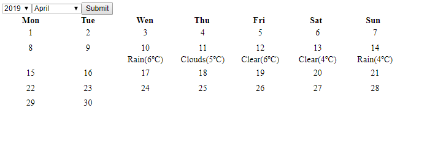

# SimpleCalendar Front
### Develop by Jairo Blanco Aldao
### Made with Visual Studio Code

## 1.Introduction
SimpleCalendar is a simple PoC of how I'll implement a very simple calendar from scratch. 
For this exercise I decided to do a Net Core API and Angular Front, it can be done in the front size makeing calls to OpenWeather API and parseing the returned values and generating the calendar days with the same algorithm used in the Net Core part. Otherwise, I thought it was more appropiate to show as many skills as I can.

Anotation: Due to time the code is not as clean as I'd like.

## 2.Implementation
For this part I used Angular 7 + TypeScript, no external libraries have been used for the development.

### 2.1 Architecture
This exercise was really simple and no escalable, so the architecture es really simple and just for mention it, the project is divided en 3 layers:

* Model: Which includes all the modules/entities/objects used by the app
* Services: Includes the services used by the app, in our case the service calls the .Net Core API and parses the response.
* Pages: Includes all the pages 

### 2.2 Code
At code level, this part has not interesting code. Just display the result obtain from the API, due to time, no error control has been implemented. 

As this is mostly a PoC data is static and not configuration is used. 

Now I'll show the main code, which is in charge of get the data:

```typescript
export class SimpleCalendarComponent implements OnInit {

  //start Calendar Properties 
  weekDays: string[] = ['Mon', 'Tue', 'Wen', 'Thu', 'Fri', 'Sat', 'Sun'];
  years: number[] = [2019, 2020, 2021, 2022, 2023, 2024, 2025];
  months: Month[] = [{month: 'January', value: 1}, {month: 'February', value: 2}, {month: 'March', value: 3},{month: 'April', value: 4}, {month: 'May', value: 5},
  {month: 'June', value: 6},{month: 'July', value: 7},{month: 'August', value: 8},{month: 'September', value: 9},{month: 'October', value: 10},{month: 'November', value: 11},
  {month: 'December', value: 12}];
  calendarData: CalendarData;
  selectedYear : number;
  selectedMonth: number;


  constructor(private _simpleCalendarService: SimpleCalendarService) { }

  async ngOnInit() {
    console.log('Starting...');
    let today = new Date();
    this.selectedMonth = today.getMonth() + 1; 
    this.selectedYear= today.getFullYear();
    this.calendarData = await this._simpleCalendarService.GetCalendarData(this.selectedYear,this.selectedMonth); 
  }

  public async getWeather() {
    console.log("Year: " + this.selectedYear);
    console.log("Month: " + this.selectedMonth);
    this.calendarData = await this._simpleCalendarService.GetCalendarData(this.selectedYear,this.selectedMonth); 
    console.log("Get Done" + this.calendarData.weeks[0].days[4].weekDay);
  }
}
```
console.log() is used for follow the trace, I'd used vs code debugger but it wasn't working properly, so I decide to get a trace for follow the response.

## 3. How to try it?
To try the application:
  0. Start .Net Core API
  1. Clone the repository
  2. Open it with VS Code
  3. run npm install
  4. run ng serve -o
  
Example of what you shoul get:


